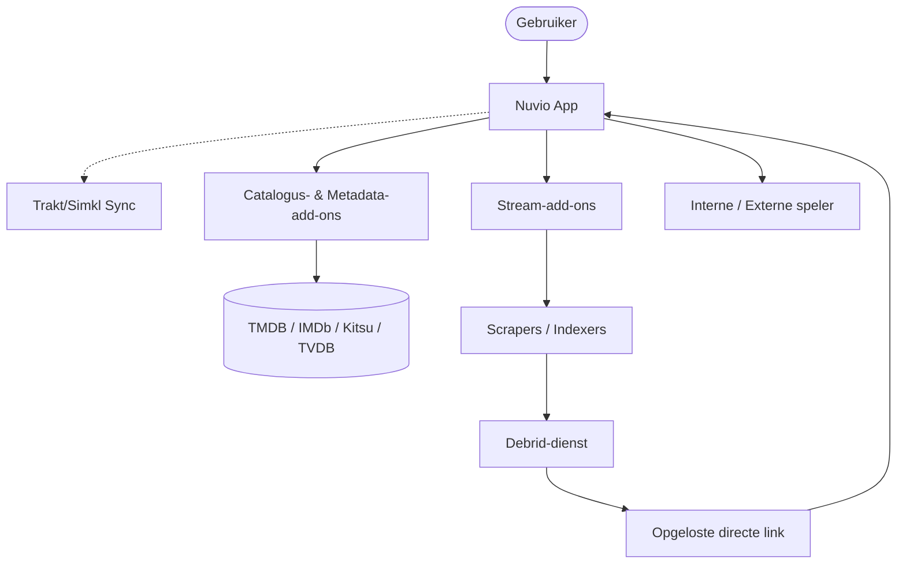

# Algemeen overzicht

Nuvio is een krachtige media-aggregator die is ontworpen om een uniforme interface te bieden voor verschillende inhoudsbronnen. Hiermee kunnen gebruikers media van meerdere aanbieders bekijken en afspelen via een zeer aanpasbare en moderne gebruikersinterface.

> [!TIP]
> Wil je gewoon snel aan de slag? Bekijk dan de [Snelstartgids](quick-start.md).

## Visuele architectuur

## Hoe het werkt

Nuvio werkt met een modulaire architectuur op basis van **Add-ons**. Van zichzelf is Nuvio een "schone" speler zonder ingebouwde inhoud.

1.  **De App:** De schil die zorgt voor de gebruikersinterface, speler en beheertools.
2.  **Add-ons:** Externe modules die "inpluggen" op Nuvio om inhoudscatalogi aan te bieden (films, series, anime).
3.  **Indexering:** Nuvio indexeert metadata van je ingeschakelde add-ons om een doorzoekbare database te creëren.

## Belangrijkste functies

- **Cross-platform:** Beschikbaar op Android (Mobiel & TV) en iOS.
- **Gecentraliseerd zoeken:** Zoek tegelijkertijd in alle geïnstalleerde add-ons.
- **Profielen:** Voeg profielen toe om alles gescheiden te houden.
- **Intro/Outro overslaan:** Maakt gebruik van introDB om intro's en outro's over te slaan.
- **Automatische bronselectie:** Speelt automatisch een bestand af op basis van je instellingen. Geen invoer nodig.
- **Trakt-integratie:** Synchroniseer je kijkgeschiedenis en lijsten.
- **Aanpasbare gebruikersinterface:** Thema's en lay-outopties die bij je apparaat passen.
