# Stream-badges-gids

Nuvio maakt gebruik van een volledig aanpasbare, op afbeeldingen en kleuren gebaseerde tagginglaag voor badges. Deze scant de titel of bestandsnaam van elke stream en toont visuele badges op je streamselectiescherm. Badges zijn niet vast of ingebouwd; ze zijn afkomstig van een **JSON-configuratiebestand** dat je importeert via een URL.

> [!NOTE]
> Badges zijn gemaakt door de community en volledig aanpasbaar. De kleuren, pictogrammen en labels die je ziet, zijn volledig afhankelijk van de badge-set die je hebt geïmporteerd. Nuvio heeft geen hardgecodeerde badgekleuren of -stijlen.

---

## Hoe het badge-systeem werkt

Wanneer je het streamselectiescherm opent, Nuvio leest de titeltekst die door je add-on voor elk resultaat wordt geretourneerd. Vervolgens vergelijkt het elke titel met een lijst van **regex-patronen** die in je badge-JSON zijn gedefinieerd. Wanneer een patroon overeenkomt, toont Nuvio de bijbehorende badge-afbeelding en kleur naast dat stream-item.

Het badge-JSON-bestand wordt gehost op een URL (bijv. op GitHub) en eenmalig geïmporteerd in je Nuvio-instellingen. Je kunt tot **3 afzonderlijke badge-JSON-URL's** tegelijkertijd importeren, waardoor je badge-sets uit meerdere bronnen kunt combineren.

---

## Badges instellen

### Waar vind je de instelling

Navigeer naar een van deze locaties, afhankelijk van je Nuvio-versie:

- Mobiel: **Instellingen → Streams → Badge URL**
- TV: **Instellingen → Lay-out → Streams → Badge URL**

### Hoe te importeren

1. Vraag een badge-JSON-URL op (zie [Community Badge-sets](#community-badge-sets) hieronder).
2. Open Nuvio en ga naar het veld **Badge URL** in de instellingen.
3. Plak de directe URL naar het `.json`-bestand.
4. Druk op **Import** (Importeren).
5. Je zou een bevestiging moeten zien zoals `1/3 URLs imported`.


> [!TIP]
> Gebruik altijd de **raw** (ruwe) GitHub-/Gist-URL voor badge-JSON-bestanden. De URL moet beginnen met `https://raw.githubusercontent.com/...` — niet de standaard GitHub-pagina-URL, want die retourneert HTML in plaats van de JSON-inhoud.

[Terug naar boven](#stream-badges-gids)

---

## Community Badge-sets

Dit zijn de meest gebruikte en aanbevolen badgeconfiguraties in de Nuvio-community. Als je liever niet rechtstreeks een raw URL importeert, zie dan het gedeelte [Badge-editor tools](#badge-editor-tools) hieronder voor webgebaseerde tools waarmee je deze sets visueel kunt bekijken, vooraf kunt bekijken en aanpassen.

### NardBadges

Een uitgebreide set van meer dan 100 badges voor de categorieën Resolutie, Kwaliteit, IMAX, Visueel (HDR), Audio, Kanalen, Encoder en Taal — onderhouden door [vowl313](https://github.com/vowl313/NardBadges).

| Variant | URL |
| :--- | :--- |
| **NardBadges** (volledige set met tier-styling) | `https://raw.githubusercontent.com/vowl313/NardBadges/refs/heads/main/NardBadges.json` |
| **NardBadges Slim** (zonder tier-indicatoren) | `https://raw.githubusercontent.com/vowl313/NardBadges/refs/heads/main/NardBadges_Slim.json` |

**Voorbeeld:**

| Volledige set (met Tier) | Slim-set (geen Tier) |
| :---: | :---: |
| 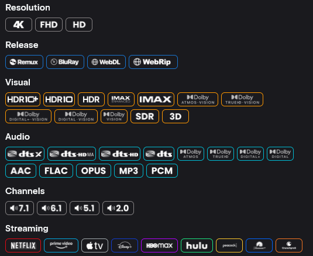 | 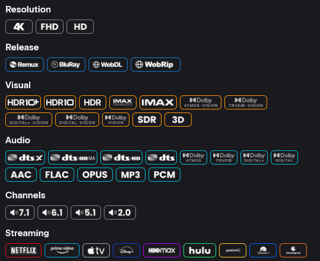 |
| 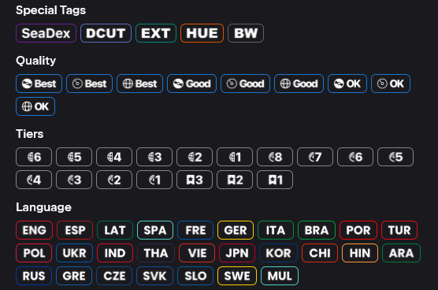 | 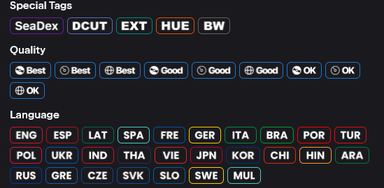 |

De NardBadges-repository bevat ook aanbevolen **Name**- en **Description**-formatteringssjablonen om met de badges te combineren. Bekijk de [NardBadges GitHub](https://github.com/vowl313/NardBadges) README voor de nieuwste formatteringsreeksen.

[Terug naar boven](#stream-badges-gids)

---

### BetterFormatter

Een zeer configureerbare badge- en formatteertoolkit met 32 preset-varianten in gekleurde en monochrome stijlen voor meerdere lay-outmodi — onderhouden door [9mousaa](https://github.com/9mousaa/BetterFormatter). Bevat ook een [webgebaseerde configurator](https://9mousaa.github.io/BetterFormatter/) voor het genereren van aangepaste presets.

BetterFormatter-presets volgen een naamgevingsconventie: `{style}-{layout}-{mode}-{dv}.json`

- **Style:** `colored` (op categorie gebaseerde kleuren) of `mono` (monochroom)
- **Layout:** `bgb` (op badges gebaseerd), `pct` (percentage), `src` (bron), `tier` (op tier gebaseerd)
- **Mode:** `combo` (gecombineerd) of `sep` (gescheiden)
- **DV handling:** `always` (altijd DV-badge tonen) of `nodv` (DV-badge verbergen)

| Variant | URL |
| :--- | :--- |
| **Gekleurde Badge-combo** (geen DV) | `https://raw.githubusercontent.com/9mousaa/BetterFormatter/main/presets/colored-bgb-combo-nodv.json` |
| **Gekleurde Badge-combo** (altijd DV) | `https://raw.githubusercontent.com/9mousaa/BetterFormatter/main/presets/colored-bgb-combo-always.json` |
| **Mono Badge-combo** (geen DV) | `https://raw.githubusercontent.com/9mousaa/BetterFormatter/main/presets/mono-bgb-combo-nodv.json` |
| **Mono Badge-combo** (altijd DV) | `https://raw.githubusercontent.com/9mousaa/BetterFormatter/main/presets/mono-bgb-combo-always.json` |

**Voorbeeld:**

| Gekleurde stijl | Monochrome stijl |
| :---: | :---: |
| **Altijd DV**<br>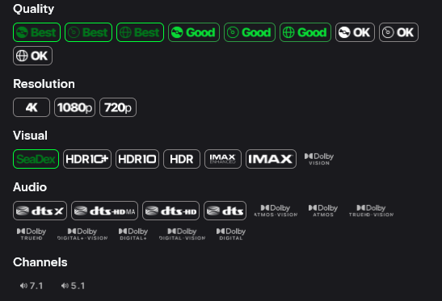 | **Altijd DV**<br>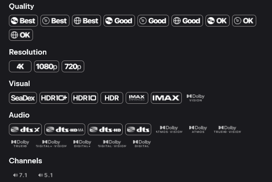 |
| **Geen DV**<br>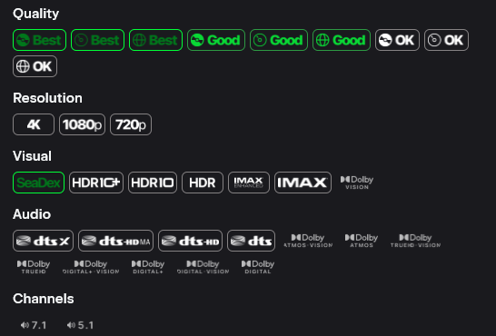 | **Geen DV**<br>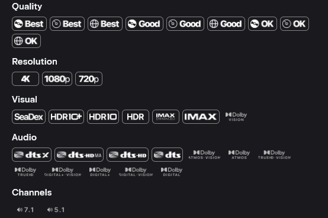 |

> [!TIP]
> De bovenstaande tabel toont de meest populaire varianten. Zie de [BetterFormatter GitHub](https://github.com/9mousaa/BetterFormatter/tree/main/presets) voor de volledige lijst van 32 presets, of gebruik de [BetterFormatter-configurator](https://9mousaa.github.io/BetterFormatter/) om een aangepaste set te bouwen.

[Terug naar boven](#stream-badges-gids)

---

### Elite Badges

Een gepolijste badge-set voor Nuvio met een premium uitstraling — onderhouden door [leonevz](https://github.com/leonevz/Elite-Badges).

| Variant | URL |
| :--- | :--- |
| **Elite Badges** | `https://raw.githubusercontent.com/leonevz/Elite-Badges/main/badges.json` |

**Voorbeeld:**

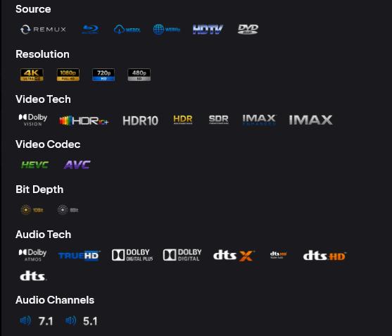

**GitHub:** [leonevz/Elite-Badges](https://github.com/leonevz/Elite-Badges)

[Terug naar boven](#stream-badges-gids)

---

### Minimalistische Badges

Een strakke, op pictogrammen gebaseerde badge-set ontworpen voor de Nuvio Android TV app met een focus op leesbaarheid — onderhouden door [sweatycab](https://github.com/sweatycab/nuvio-minimalist-badges). Bevat AIOStreams-formatteringssjablonen met onzichtbare Unicode-tokens voor betrouwbare detectie van het dynamisch bereik.

| Variant | URL |
| :--- | :--- |
| **Minimalistisch Wit** | `https://raw.githubusercontent.com/sweatycab/nuvio-minimalist-badges/main/badges-white.json` |
| **Minimalistisch Wit** (geen codecs) | `https://raw.githubusercontent.com/sweatycab/nuvio-minimalist-badges/main/badges-white-no-codecs.json` |
| **Minimalistisch Gemengd** (kleur) | `https://raw.githubusercontent.com/sweatycab/nuvio-minimalist-badges/main/badges-mixed.json` |
| **Minimalistisch Gemengd** (geen codecs) | `https://raw.githubusercontent.com/sweatycab/nuvio-minimalist-badges/main/badges-mixed-no-codecs.json` |

**Voorbeeld:**

| Minimalistisch Wit | Minimalistisch Wit (Geen Codecs) |
| :---: | :---: |
| 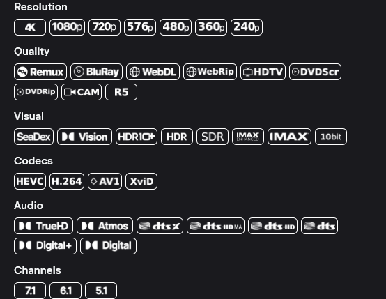 | 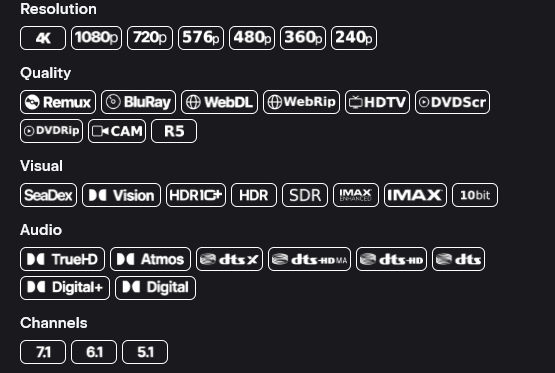 |

> [!TIP]
> De minimalistische set werkt het best in combinatie met de meegeleverde AIOStreams-formatteringssjablonen. Zie de [repository README](https://github.com/sweatycab/nuvio-minimalist-badges) voor de bijbehorende `title-template.txt`- en `description-template.txt`-bestanden.

[Terug naar boven](#stream-badges-gids)

---

## Badge-editor tools

Wil je niet handmatig raw JSON-URL's plakken? Met deze door de community gebouwde webtools kun je badgeconfiguraties visueel bekijken, aanpassen, vooraf bekijken en exporteren.

| Tool | Beschrijving |
| :--- | :--- |
| [Badger](https://nintle.github.io/Badger/) | De meest populaire badge-editor — blader door community-sjablonen, schakel afzonderlijke badges in/uit, verander kleuren en afbeeldingen, bekijk voorbeelden met echte titels en genereer een deelbare JSON-URL. ([GitHub](https://github.com/Nintle/Badger)) |
| [BetterFormatter-configurator](https://9mousaa.github.io/BetterFormatter/) | Bouw aangepaste BetterFormatter-presets met een visuele editor — kies stijl, lay-out, modus en DV-verwerking. |

---

## Wat badges weergeven

Het badge-systeem herkent metadata die rechtstreeks uit streamtitels is geanalyseerd. Badges zijn meestal georganiseerd in deze categorieën:

| Categorie | Voorbeelden |
| :--- | :--- |
| **Resolutie** | 4K, 2K, FHD, HD, 576p, 480p, 360p, 240p, 144p |
| **Kwaliteit / Bron** | Remux, BluRay, WebDL, WebRip, HDRip, HC HDRip, DVDRip, HDTV, SCR, TC, TS, CAM |
| **IMAX** | IMAX Enhanced, IMAX |
| **Visueel / HDR** | Dolby Vision, HDR10+, HDR10, HDR, SDR, 10bit, HLG, AI |
| **Audio** | ATMOS / TrueHD, DTS:X / DTS-HD MA, ATMOS / DD+, TrueHD, DD+, DD, DTS-HD MA, DTS-HD, DTS-ES, DTS, FLAC, OPUS, AAC |
| **Kanalen** | 7.1, 6.1, 5.1, 2.0, 1.0 |
| **Encoder** | AV1, HEVC, AVC, XviD, DivX |
| **Taal** | Verschillende landsvlaggen, afhankelijk van de badge-set |

Badges worden alleen weergegeven als de streamtitel tekst bevat die overeenkomt met het regex-patroon van de badge. Als je add-on geen kwaliteitsinformatie in de streamtitels opneemt, worden er mogelijk geen badges weergegeven.

[Terug naar boven](#stream-badges-gids)

---

## Badge-prioriteitshiërarchie

Wanneer een streamtitel overeenkomt met meerdere badges in dezelfde categorie, gebruikt Nuvio een **prioriteitshiërarchie** om te bepalen welke badge wordt weergegeven. De hieronder getoonde hiërarchie is de volgorde waarin Nuvio de weergegeven badge selecteert — de eerste match wint.

### Resolutie

```
4K → 2K → FHD → HD → 576p → 480p → 360p → 240p → 144p
```

### Kwaliteit / Bron

```
Remux → BluRay → WebDL → WebRip → HDRip → HC HDRip → DVDRip → HDTV → SCR → TC → TS → CAM
```

### IMAX

```
IMAX Enhanced → IMAX
```

### Visueel / HDR

```
Dolby Vision  ─┐
HDR10+        ─┘→ HDR10 → HDR → SDR

10bit → HLG → AI  (afzonderlijk spoor)
```

### Audio (Dolby-spoor)

```
ATMOS / TrueHD → ATMOS / DD+ → TrueHD → DD+ → DD
```

### Audio (DTS-spoor)

```
DTS:X / DTS-HD MA → DTS-HD MA → DTS-HD → DTS-ES → DTS
```

### Audio (Overig)

```
FLAC → OPUS → AAC
```

### Kanalen

```
7.1 → 6.1 → 5.1 → 2.0 → 1.0
```

### Encoder

```
AV1 → HEVC → AVC → XviD → DivX
```

> [!NOTE]
> Deze hiërarchie wordt bepaald door de volgorde van de items in je badge-JSON-bestand. Badge-sets zoals NardBadges zijn al in de juiste volgorde geplaatst. Als je een aangepaste set bouwt, plaats dan badges met een hogere prioriteit eerder in de `filters`-array.

[Terug naar boven](#stream-badges-gids)

---

## Aangepaste badges maken

Als je liever je eigen badge-JSON schrijft, gebruikt Nuvio het volgende schema:

```json
{
  "filters": [
    {
      "id": "unique-badge-id",
      "groupId": "resolution",
      "name": "4K",
      "pattern": "(?i)\\b(4k|2160p|uhd)\\b",
      "imageURL": "https://example.com/badges/4k.png",
      "tagColor": "#33FFFFFF",
      "borderColor": "#FFAAAAAA"
    }
  ]
}
```

| Veld | Beschrijving |
| :--- | :--- |
| `id` | Een unieke tekstidentificatie voor dit badge-item. |
| `groupId` | De categoriegroep (bijv. `resolution`, `audio`, `visual`). Per stream wordt slechts één badge per groep getoond. |
| `name` | Het weergavelabel dat wordt gebruikt voor toegankelijkheid en fallback-tekst. |
| `pattern` | Een **regex**-patroon waarmee de streamtitel wordt vergeleken. Gebruik `(?i)` voor hoofdletterongevoelige matching. |
| `imageURL` | Een directe URL naar de badge-afbeelding (PNG aanbevolen). |
| `tagColor` | Achtergrondkleur in `#AARRGGBB`-formaat (alfa eerst). |
| `borderColor` | Randkleur in `#AARRGGBB`-formaat (alfa eerst). |

> [!TIP]
> Kleuren in de JSON gebruiken Android's `#AARRGGBB`-formaat — de eerste twee hexadecimale cijfers zijn **alfa (dekking)**, niet de standaard web `#RRGGBB`. Bijvoorbeeld: `#FF0877F9` is volledig ondoorzichtig Nuvio-blauw, terwijl `#330877F9` 20% dekkingsblauw is.

> [!IMPORTANT]
> Het veld `groupId` regelt de exclusiviteit van badges. Er wordt slechts één badge per `groupId` per stream-item getoond. Badges binnen dezelfde groep concurreren op basis van hun volgorde in de `filters`-array — de eerste match wint. Plaats badges met een hogere prioriteit eerder in de lijst.

[Terug naar boven](#stream-badges-gids)

---

## Probleemoplossing

| Probleem | Oplossing |
| :--- | :--- |
| Badges verschijnen niet na het importeren | Zorg ervoor dat je de **raw** GitHub-URL gebruikt (begint met `raw.githubusercontent.com`). |
| Badge-URL verdwijnt na het opslaan | Bekend probleem — importeer de URL en **sluit af zonder op Save (Opslaan) te drukken**. |
| Badges worden getoond maar met de verkeerde prioriteit | De volgorde van de `filters`-array in de badge-set bepaalt de prioriteit. Wijzig de volgorde van de items of gebruik Badger om dit aan te passen. |
| Geen badges op streams van een specifieke add-on | De add-on bevat mogelijk geen kwaliteitsmetadata in de streamtitels. Controleer het uitvoerformaat van de add-on. |
| Badges zien er anders uit dan op de screenshots | Het uiterlijk van de badges hangt af van de set die je hebt geïmporteerd. Kleuren en pictogrammen zijn volledig aanpasbaar — verschillende sets zien er anders uit. |

---

## Handige bronnen

| Bron | Beschrijving |
| :--- | :--- |
| [Badger](https://nintle.github.io/Badger/) | Community-webtool voor het maken en bewerken van badge-JSON zonder te coderen. |
| [Badger GitHub](https://github.com/Nintle/Badger) | Broncode en documentatie voor de Badger-tool. |
| [NardBadges GitHub](https://github.com/vowl313/NardBadges) | Populaire set met meer dan 100 badges met volledige en slim-varianten, plus formatteringssjablonen. |
| [Colorful & Concise GitHub](https://github.com/danielsdian/ColorfulAndConcise) | Betrouwbare badges met branding van streamingplatforms en AIOStreams-formatter. |
| [BetterFormatter GitHub](https://github.com/9mousaa/BetterFormatter) | 32 preset-varianten met gekleurde/monochrome stijlen en een webconfigurator. |
| [BetterFormatter-configurator](https://9mousaa.github.io/BetterFormatter/) | Webtool voor het bouwen van aangepaste BetterFormatter-badge-presets. |
| [Elite Badges GitHub](https://github.com/leonevz/Elite-Badges) | Premium gestileerde badge-set door leonevz. |
| [Minimalistische Badges GitHub](https://github.com/sweatycab/nuvio-minimalist-badges) | Strakke, op pictogrammen gebaseerde badges met AIOStreams-formatteringssjablonen. |
| [r/Nuvio](https://www.reddit.com/r/Nuvio/) | Discussie binnen de community — vind nieuwe badge-sets en formatteringssjablonen die door andere gebruikers worden gedeeld. |
| [Nuvio Discord](https://discord.gg/nuvio) | Directe hulp van de community voor vragen over badgeconfiguratie. |

[Terug naar boven](#stream-badges-gids)
