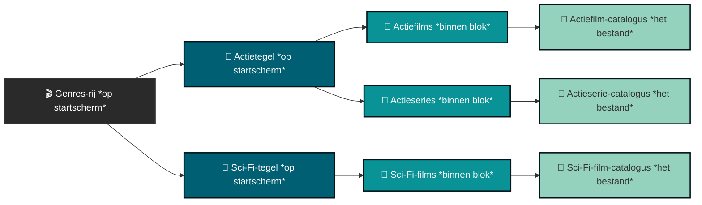

# Collections

> [!CAUTION]
> Het maken van collections moet worden beschouwd als een feature voor geavanceerde gebruikers (serieus, dit is een waarschuwing). Als je jezelf geen geavanceerde gebruiker vindt, wordt aangeraden om in plaats daarvan een collection te kopiëren van [Nuvio's community-collections](https://nuvio.tv/community-collections).

---

### De structuur van een collection begrijpen

Nuvio-collections kunnen verwarrend zijn, maar in de basis zijn ze gewoon een bestandssysteem: mappen met daarin submappen, die bestanden (catalogi) bevatten. Het onderstaande diagram illustreert deze relatie.

[Terug naar boven](#collections)

### Voordat je begint

Je hebt twee dingen nodig om een collection te maken:

1. **Een metadata-addon met je catalogi** die al is ingesteld en de catalogi bevat die je wilt opnemen. Deze gids gaat ervan uit dat dit is gebeurd.
2. **Afbeeldingen of GIF's voor je collection-covers**, afkomstig van internet of van [Nuvio's community covers](https://nuvio.tv/covers).
   - Als je geen community-cover gebruikt, moet de URL rechtstreeks naar het afbeelding- of GIF-bestand zelf verwijzen — niet naar een webpagina die de afbeelding toont:
     - ❌ Onjuist: `https://github.com/rrevanth/nuvio-assets/blob/main/popular/new/new-poster.png`
     - ✅ Juist: `https://raw.githubusercontent.com/rrevanth/nuvio-assets/refs/heads/main/popular/new/new-poster.png`
   - Je bent ook van harte welkom om je eigen afbeeldingen of GIF's te uploaden naar de community-collections van Nuvio, zodat anderen ze kunnen gebruiken.

[Terug naar boven](#collections)

### Je eerste collection maken

Je kunt een collection maken in de app of op de Nuvio-website — de website wordt aanbevolen.

1. Zorg er na het inloggen voor dat je op het tabblad **Account** bent.
2. Selecteer **Collections** (Collections) in de linkerzijbalk.
3. Selecteer **Create Collection** (Collection maken).
4. Er wordt gevraagd om een startsjabloon te kiezen — selecteer **Continue** (Doorgaan) om dit voor nu over te slaan.
5. Configureer de algemene instellingen van de collection:
   - **Collection ID**: laat dit ongewijzigd.
   - **Title**: de naam die voor de collection wordt weergegeven.
   - **View Mode**: kies een van de drie lay-outs:
     - **Tabbed Grid**: elke submap verschijnt als een eigen tabblad, weergegeven in een raster. Bijvoorbeeld: een actie-catalogus met submappen "Actiefilms 2020" en "Actiefilms 2010" toont elk als een afzonderlijk tabblad.
     - **Rows**: elke submap verschijnt als een eigen rij, allemaal onder één tabblad. In hetzelfde voorbeeld verschijnen "Actiefilms 2020" en "Actiefilms 2010" als afzonderlijke rijen onder één tabblad.
     - **Follow Layout**: volgt de lay-out die in de Nuvio-app is ingesteld.
   - **Backdrop Image or GIF URL**: de afbeeldings-URL zoals beschreven bij [Voordat je begint](#voordat-je-begint).
   - **Show All Tab**: voegt een extra tabblad toe dat alle submappen in deze collection combineert.
   - **Pin to Top**: verplaatst de collection naar boven, vóór andere collections.
   - **Enable Focus Glow**: voegt een oplichtend effect toe bij het aanwijzen van de collection.
6. Schakel over naar het tabblad **Folders** (Mappen) om de inhoud van de collection te configureren — dit wordt hieronder in detail besproken.

[Terug naar boven](#collections)

### Het tabblad Folders

Op het tabblad Folders definieer je de submappen ("blokken") waaruit je collection bestaat:

- **Outline** (linkerzijbalk): voeg één item toe per blok dat je op je startscherm wilt tonen. Een collection "Franchises" kan bijvoorbeeld afzonderlijke items hebben voor The Matrix, The Lord of the Rings en Star Wars.
- **Folder ID**: laat dit ongewijzigd.
- **Folder Title**: de naam die wordt getoond voor het tabblad of de rij van deze map. In een collection "Actie" kunnen mappen bijvoorbeeld de titel "Actiefilms 2020" en "Actiefilms 2010" hebben.
- **TileShape**: kies **Landscape** (Liggend), **Square** (Vierkant) of **Portrait** (Staand).
- **Sources**: vul de map met behulp van **Add Catalog**, **Add TMDB** of **Add Trakt**, zoals hieronder beschreven.

[Terug naar boven](#collections)

#### Add Catalog (Catalogus toevoegen)

Kies de addon die de gewenste catalogus bevat (bijv. AIOMetadata) en selecteer vervolgens de specifieke catalogus die je met die addon hebt gemaakt.

#### Add TMDB (TMDB toevoegen)

TMDB-bronnen worden geconfigureerd via drie groepen instellingen.

**Algemene instellingen** *(gemeenschappelijk voor alle TMDB-bronnen)*

Deze instellingen bepalen de basisweergave en volgorde van je collection binnen Nuvio.

- **Type**: het mediaformaat voor de lijst — ofwel **Movie** (Film) of **Series** (Serie).
- **Name**: de aangepaste titel voor deze collection, weergegeven zoals ingevoerd (bijv. "Top Sci-Fi" of "Mijn volglijst").
- **Sort By**: (Sorteren op)
  - **Original**: de volgorde die is ingesteld door de maker van de database of de lijst.
  - **Recent**: gesorteerd op releasedatum.
  - **Top Rated**: gerangschikt op beoordelingsscore of aantal stemmen.

**Op ID gebaseerde bronnen**

De meeste bronnen hebben een specifieke identificatiecode nodig om de juiste metadata uit de respectievelijke database op te halen.

- **Bronnen**: TMDB List, Trakt List, TMDB Keyword, TMDB Company, TMDB Collection.
- **ID Field**: een numerieke of alfanumerieke code, te vinden in de URL van de betreffende lijst, collection, bedrijf of trefwoord op TMDB of Trakt. Bijvoorbeeld: in `themoviedb.org/collection/1248` is de ID `1248`.

**Unieke bronnen**

Een paar bronnen gebruiken andere invoervelden in plaats van een standaard-ID:

- **TMDB Discover**: selecteer in plaats van een ID een of meer genres (bijv. Action, Horror, Science Fiction) uit een dropdown-menu. Dit bouwt dynamisch een collection op van media die overeenkomen met die categorieën uit de database van TMDB.
- **Letterboxd List**: plak de volledige URL van de Letterboxd-lijst die je wilt importeren. Gebruik de exacte link uit je browser in plaats van te zoeken naar een afzonderlijke ID.

[Terug naar boven](#collections)

#### Add Trakt (Trakt toevoegen)

Trakt-bronnen worden geconfigureerd via twee groepen instellingen.

**Kerninstellingen** *(altijd vereist)*

Wanneer je een nieuwe collection met Trakt als bron maakt, configureer dan eerst deze basisopties:

- **Type**: het mediaformaat voor de rij — ofwel **Movie** (Film) of **Series** (Serie).
- **Name**: het aangepaste label voor deze collection, getoond op je Nuvio-startscherm (bijv. "Mijn Trakt-volglijst" of "Populaire series").
- **Sort By**: (Sorteren op)
  - **Default**: de standaardvolgorde van Trakt.
  - **Title (asc/desc)**: alfabetisch (oplopend/aflopend).
  - **Primary Release Date (asc/desc)**: chronologisch, op basis van releasejaar.

**Bronspecifieke instellingen**

Na het kiezen van je Trakt-brontype uit het dropdown-menu, configureer je de unieke velden:

- **Trakt List**: haalt een specifieke, statische lijst op die is gemaakt door jou of een andere Trakt-gebruiker.
  - **URL**: het volledige webadres van de gewenste Trakt-lijst.

> [!CAUTION]
> **De opmaak van de URL is belangrijk.** De link moet het standaard desktop-domeinformaat gebruiken — Nuvio kan geen mobiele links of links die door apps zijn gegenereerd lezen.
>
> - ✅ Juist: `https://trakt.tv/users/...`
> - ❌ Onjuist: `https://app.trakt.tv/...`
>
> Het gebruik van een `app.trakt.tv`-link zorgt ervoor dat de collection niet kan synchroniseren en leeg blijft.

[Terug naar boven](#collections)
