# Stream Badges Guide

Nuvio displays a set of **stream badges** next to every available source in the stream selection list. These badges are generated directly from the file's metadata and tell you exactly what you're getting before you press play — no guessing required.

> [!NOTE]
> Badges are read from the stream title/filename that your addon returns. Nuvio does not transcode or alter streams. What the badge shows is what the source file actually contains.

---

## How to Read the Badge Colors

Each badge category uses a **color tier system** to instantly communicate quality at a glance:

| Color | Border | Tier |
| :--- | :--- | :--- |
| 🟡 **Yellow** | Gold outline | Top tier — premium / lossless |
| 🔵 **Blue** | Blue outline | High tier — excellent quality |
| 🟢 **Green** | Green outline | Good tier — solid everyday quality |
| 🟠 **Orange** | Orange outline | Mid tier — compressed / lower quality |
| 🔴 **Red** | Red outline | Low tier — highly compressed / poor source |

The hierarchy flows from yellow → blue → green → orange → red. The higher the tier, the better the quality.

---

## Badge Categories

Nuvio organizes badges into six categories. Each badge on a stream card will come from one of these groups.

---

### 🖥️ Resolution

The native pixel dimensions of the video. Higher resolution means more detail.

| Badge | Tier | Notes |
| :--- | :---: | :--- |
| **4K** | 🟡 Yellow | Ultra HD — 3840×2160. Requires a capable display and strong connection. |
| **2K** | 🔵 Blue | Quad HD — 2560×1440. Less common; usually a cinema DCP rip. |
| **FHD** | 🟢 Green | Full HD — 1920×1080. The standard for most high-quality releases. |
| **HD** | 🟠 Orange | HD — 1280×720. Acceptable, noticeably softer on large screens. |
| **576p** | 🔴 Red | PAL DVD quality — visible compression on modern displays. |
| **480p** | 🔴 Red | NTSC DVD quality — SD. |
| **360p** | 🔴 Red | Web-compressed SD. |
| **240p** | 🔴 Red | Very low quality. |
| **144p** | 🔴 Red | Minimum quality. Streaming fallback only. |

---

### 🎬 Quality (Source)

The release type, reflecting the origin of the file and how much it has been compressed.

| Badge | Tier | Notes |
| :--- | :---: | :--- |
| **Remux** | 🟡 Yellow | A lossless rip of a Blu-ray disc. Zero compression. The gold standard for home theater. |
| **BluRay** | 🔵 Blue | Compressed from Blu-ray. Excellent quality; smaller than a Remux. |
| **WebDL** | 🟢 Green | Downloaded directly from a streaming service at native quality. |
| **WebRip** | 🟠 Orange | Captured/re-encoded from a streaming service. Slightly lower than WebDL. |
| **HDRip** | 🔴 Red | Encoded from an HDR source; quality varies. |
| **HC HDRip** | 🔴 Red | Hardcoded subtitle rip — burned-in subtitles cannot be removed. |
| **DVDRip** | 🔴 Red | Ripped from a DVD disc. |
| **HDTV** | 🔴 Red | Captured from a live TV broadcast; can include logos, artifacts. |
| **SCR** | 🔴 Red | Screener — early promotional copy sent to critics; may have watermarks. |
| **TC** | 🔴 Red | Telecine — filmed from a film print using a telecine machine. |
| **TS** | 🔴 Red | Telesync — recorded in a theater using a camera on a tripod. |
| **CAM** | 🔴 Red | Camrip — recorded in a theater by hand. Lowest possible source quality. |

> [!TIP]
> For the best experience pair a **Remux** or **BluRay** quality with a Debrid service like TorBox or Premiumize. See the [Debrid Integration guide](/integrations/debrid) for setup instructions.

---

### 🏟️ IMAX

Indicates whether the stream contains an IMAX-mastered picture.

| Badge | Tier | Notes |
| :--- | :---: | :--- |
| **IMAX Enhanced** | 🟡 Yellow | Full IMAX Enhanced certification — expanded 1.90:1 aspect ratio with DTS:X audio. |
| **IMAX** | 🔵 Blue | IMAX Digital remaster — improved contrast and sound mix. |

> [!NOTE]
> IMAX Enhanced content uses a wider aspect ratio (fills more of the screen vertically). If black bars are narrower than usual, this is expected behavior for IMAX-formatted releases.

---

### 🎨 Visual (HDR / Color Format)

Describes the High Dynamic Range format and color encoding of the stream.

| Badge | Tier | Notes |
| :--- | :---: | :--- |
| **Dolby Vision** | 🟡 Yellow | The premium HDR format. Scene-by-scene dynamic metadata for best-in-class color accuracy. Requires a Dolby Vision-capable display. |
| **HDR10+** | 🟡 Yellow | Dynamic HDR with frame-by-frame metadata. Second only to Dolby Vision. |
| **HDR10** | 🔵 Blue | Standard HDR with static metadata. Excellent on any HDR-capable TV. |
| **HDR** | 🟢 Green | Generic HDR flag — format not specified. |
| **SDR** | 🟠 Orange | Standard Dynamic Range — no HDR. Works on all displays. |
| **10bit** | 🟠 Orange | 10-bit color depth without HDR metadata. Better gradients than 8-bit SDR. |
| **HLG** | 🟠 Orange | Hybrid Log-Gamma — a broadcast HDR standard common in live TV and streaming. |
| **AI** | 🔴 Red | AI-upscaled content. Quality depends on the upscaling model used. |

> [!TIP]
> For Dolby Vision streams, make sure to review the [DV7 HEVC Fallback and DV5 to DV8.1 settings](/settings/player#advanced-processing--decoding) in the Player guide if you experience purple/green color distortion.

---

### 🔊 Audio

Describes the audio codec or format of the stream. Two separate badge groups cover this: the main codec family and the DTS variant.

#### Primary Audio Codec

| Badge | Tier | Notes |
| :--- | :---: | :--- |
| **ATMOS / TRUEHD** | 🟡 Yellow | Dolby Atmos embedded in a TrueHD lossless track. The pinnacle of object-based surround sound. |
| **DTS:X / DTS-HD MA** | 🟡 Yellow | DTS:X object-based audio inside a DTS-HD Master Audio lossless container. |
| **ATMOS / DD+** | 🔵 Blue | Dolby Atmos delivered in a compressed Dolby Digital Plus container (common on streaming services). |
| **TRUEHD** | 🔵 Blue | Dolby TrueHD lossless — the same codec used on Blu-ray discs. |
| **DTS:X / DTS-HD** | 🔵 Blue | DTS:X object-based audio in a standard DTS-HD container. |
| **DD+** | 🟢 Green | Dolby Digital Plus (EAC-3) — compressed but high-quality; supports up to 7.1 channels. |
| **DTS-HD MA** | 🟢 Green | DTS-HD Master Audio lossless — equivalent quality to TrueHD. |
| **DTS-HD** | 🟠 Orange | DTS-HD lossy — higher quality than standard DTS but compressed. |
| **DTS-ES** | 🟠 Orange | DTS Extended Surround — a 6.1 variant of standard DTS. |
| **FLAC** | 🟢 Green | Free Lossless Audio Codec — lossless, common in music and some film rips. |
| **OPUS** | 🟠 Orange | Modern open-source lossy codec; excellent quality at low bitrates. |
| **DD** | 🔴 Red | Dolby Digital (AC-3) — the legacy 5.1 standard from DVD. |
| **DTS** | 🔴 Red | Standard DTS — legacy lossy surround format. |
| **AAC** | 🔴 Red | Advanced Audio Codec — common compressed stereo/surround format from streaming. |

> [!TIP]
> If you are using an **optical (SPDIF) connection** to an older AV receiver, enable **Force AC-3 Transcoding** in the Player settings. Optical connections cannot carry TrueHD, DTS-HD MA, or Atmos and will produce silence or static without transcoding. See the [Player Guide](/settings/player#advanced-processing--decoding).

---

### 🎵 Channels

The number of discrete audio channels in the stream.

| Badge | Tier | Notes |
| :--- | :---: | :--- |
| **7.1** | 🟡 Yellow | 8-channel surround (L/R, C, LFE, LS/RS, LBS/RBS). Full immersive surround. |
| **6.1** | 🔵 Blue | 7-channel surround. Rare; found in older DTS-ES releases. |
| **5.1** | 🟢 Green | 6-channel surround (L/R, C, LFE, LS/RS). The most common home theater format. |
| **2.0** | 🟠 Orange | Stereo. Great for headphones and 2-speaker setups. |
| **1.0** | 🔴 Red | Mono. Very rare; typically only in older or CAM-quality sources. |

> [!TIP]
> If you are on a **stereo-only setup** (TV speakers or a soundbar) but a stream is showing 5.1 or 7.1 audio and the dialogue sounds quiet, enable **Downmix** in Settings → Playback → Audio to properly fold the surround channels into stereo. See the [Player Guide](/settings/player#audio-settings).

---

### 🎞️ Encoder

The video codec used to compress and encode the stream.

| Badge | Tier | Notes |
| :--- | :---: | :--- |
| **AV1** | 🟡 Yellow | The latest open-source codec. Best compression efficiency; requires modern hardware to decode. |
| **HEVC** | 🔵 Blue | H.265 — the current standard for 4K and HDR. Excellent quality at lower file sizes vs. H.264. |
| **AVC** | 🟢 Green | H.264 — the universal standard. Plays everywhere with minimal CPU. |
| **XviD** | 🟠 Orange | An older MPEG-4 codec. Common in DVDRip and early web releases. |
| **DivX** | 🔴 Red | Legacy MPEG-4 codec. Very old; found only in very old releases. |

> [!NOTE]
> **AV1** streams may require hardware decoding support. If an AV1 stream stutters or fails, try switching the **Decoder Priority** to *Prefer app decoders (FFmpeg)* in the [Player settings](/settings/player#advanced-processing--decoding) [Android TV Only].

---

## Reading a Full Stream Entry

A stream card in Nuvio can display multiple badges at once. Here is how to interpret a typical high-quality combination:

```
4K  |  Remux  |  IMAX Enhanced  |  Dolby Vision  |  ATMOS / TRUEHD  |  7.1  |  HEVC
```

This tells you:
- **4K** resolution
- **Remux** — lossless, direct Blu-ray rip
- **IMAX Enhanced** — expanded aspect ratio with IMAX mastering
- **Dolby Vision** — premium dynamic HDR
- **ATMOS / TRUEHD** — object-based lossless surround
- **7.1 channels** — full immersive surround field
- **HEVC** encoder — efficient H.265 compression

And a more typical streaming-quality entry:

```
FHD  |  WebDL  |  HDR10  |  DD+  |  5.1  |  AVC
```

- Full HD, downloaded directly from a streaming platform, HDR10 color, Dolby Digital Plus 5.1 in H.264.

---

## Badge Hierarchy Reference Chart

The full priority tree from the provided diagram, top to bottom within each category:

```mermaid
flowchart TD
  subgraph Resolution
    R1[4K] --> R2[2K] --> R3[FHD] --> R4[HD] --> R5[576p] --> R6[480p] --> R7[360p] --> R8[240p] --> R9[144p]
  end
  subgraph Quality
    Q1[Remux] --> Q2[BluRay] --> Q3[WebDL] --> Q4[WebRip] --> Q5[HDRip] --> Q6[HC HDRip] --> Q7[DVDRip] --> Q8[HDTV] --> Q9[SCR] --> Q10[TC] --> Q11[TS] --> Q12[CAM]
  end
  subgraph IMAX
    I1[IMAX Enhanced] --> I2[IMAX]
  end
  subgraph Visual
    V1[Dolby Vision] --- V2[HDR10+] --> V3[HDR10] --> V4[HDR] --> V5[SDR]
    V6[10bit] --- V7[HLG]
    V8[AI]
  end
  subgraph Audio
    A1[ATMOS / TRUEHD] --> A2[ATMOS / DD+] --> A3[TRUEHD] --> A4[DD+] --> A5[DD]
    A6[DTS:X / DTS-HD MA] --> A7[DTS-HD MA] --> A8[DTS-HD] --> A9[DTS-ES] --> A10[DTS]
    A11[FLAC] --- A12[OPUS] --- A13[AAC]
  end
  subgraph Channels
    C1[7.1] --> C2[6.1] --> C3[5.1] --> C4[2.0] --> C5[1.0]
  end
  subgraph Encoder
    E1[AV1] --> E2[HEVC] --> E3[AVC] --> E4[XviD] --> E5[DivX]
  end
```



---

## Filtering Streams by Badge (Regex Mode)

If you prefer to filter streams automatically rather than reading each badge manually, you can use **Regex Selection Mode** to auto-play only streams that match specific quality badges. See the [Stream Selection guide](/settings/player#stream-selection-and-stream-auto-play) for setup details.

**Examples:**
- Match only 4K Remux sources: `4K.*Remux`
- Match any lossless audio: `TrueHD|DTS-HD MA|FLAC`
- Match HEVC or AV1 encoded: `HEVC|AV1`
- Avoid CAM and TS sources: `^(?!.*(CAM|\.TS\b|\.TC\b)).*$`

---

## Helpful Resources

| Resource | Description |
| :--- | :--- |
| [Nuvio Player Settings](/settings/player) | Configure decoder priority, audio downmix, and optical transcoding based on your badge readings. |
| [Debrid Integration Guide](/integrations/debrid) | Set up TorBox or Premiumize to unlock high-quality Remux and 4K badge streams. |
| [AIOStreams Configuration](/addons/) | Configure your P2P scraper to return streams with accurate quality badges. |
| [Nuvio Discord](https://discord.gg/nuvio) | Community help for badge and stream quality questions. |
| [Stremio Addons List](https://stremio-addons.net/) | Browse compatible addons and verify which quality badges each addon returns. |
| [TRaSH Guides — Quality Definitions](https://trash-guides.info/Radarr/Radarr-recommended-naming-scheme/) | In-depth reference for understanding file naming conventions that produce these badges. |
| [Viren070's Nuvio Guide](https://guides.viren070.me/) | Community guide with addon setup recommendations. |

[Back to top](#stream-badges-guide)

