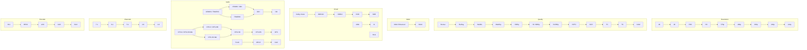

```mermaid
graph TD
    subgraph Resolution
        Res4K[4K] --> Res2K[2K]
        Res2K --> ResFHD[FHD]
        ResFHD --> ResHD[HD]
        ResHD --> Res576p[576p]
        Res576p --> Res480p[480p]
        Res480p --> Res360p[360p]
        Res360p --> Res240p[240p]
        Res240p --> Res144p[144p]
    end

    subgraph Quality
        QRemux[Remux] --> QBluRay[BluRay]
        QBluRay --> QWebDL[WebDL]
        QWebDL --> QWebRip[WebRip]
        QWebRip --> QHDRip[HDRip]
        QHDRip --> QHCHDRip[HC HDRip]
        QHCHDRip --> QDVDRip[DVDRip]
        QDVDRip --> QHDTV[HDTV]
        QHDTV --> QSCR[SCR]
        QSCR --> QTC[TC]
        QTC --> QTS[TS]
        QTS --> QCAM[CAM]
    end

    subgraph IMAX
        IMAXE[IMAX Enhanced] --> IMAXB[IMAX]
    end

    subgraph Visual
        VDV[Dolby Vision] --> VHDR10P[HDR10+]
        VHDR10P --> VHDR10[HDR10]
        VHDR10 --> VHDR[HDR]
        VHDR --> VSDR[SDR]
        
        V10bit[10bit] --> VAI[AI]
        VHLG[HLG]
    end

    subgraph Audio
        %% Dolby Branch
        A_ATMOS_TRUE[ATMOS / TRUEHD] --> A_ATMOS_DDP[ATMOS / DD+]
        A_ATMOS_TRUE --> A_TRUEHD[TRUEHD]
        A_ATMOS_DDP --> A_DDP[DD+]
        A_TRUEHD --> A_DDP
        A_DDP --> A_DD[DD]

        %% DTS Branch
        A_DTSX_MA[DTS:X / DTS-HD MA] --> A_DTSX_HD[DTS:X / DTS-HD]
        A_DTSX_MA --> A_DTSHD_MA[DTS-HD MA]
        A_DTSX_HD --> A_DTSHD[DTS-HD]
        A_DTSHD_MA --> A_DTSHD
        A_DTSHD --> A_DTSES[DTS-ES]
        A_DTSES --> A_DTS[DTS]

        %% Other Audio
        A_FLAC[FLAC] --> A_OPUS[OPUS]
        A_OPUS --> A_AAC[AAC]
    end

    subgraph Channels
        C71[7.1] --> C61[6.1]
        C61 --> C51[5.1]
        C51 --> C20[2.0]
        C20 --> C10[1.0]
    end

    subgraph Encoder
        EAV1[AV1] --> EHEVC[HEVC]
        EHEVC --> EAVC[AVC]
        EAVC --> EXviD[XviD]
        EXviD --> EDivX[DivX]
    end
```
